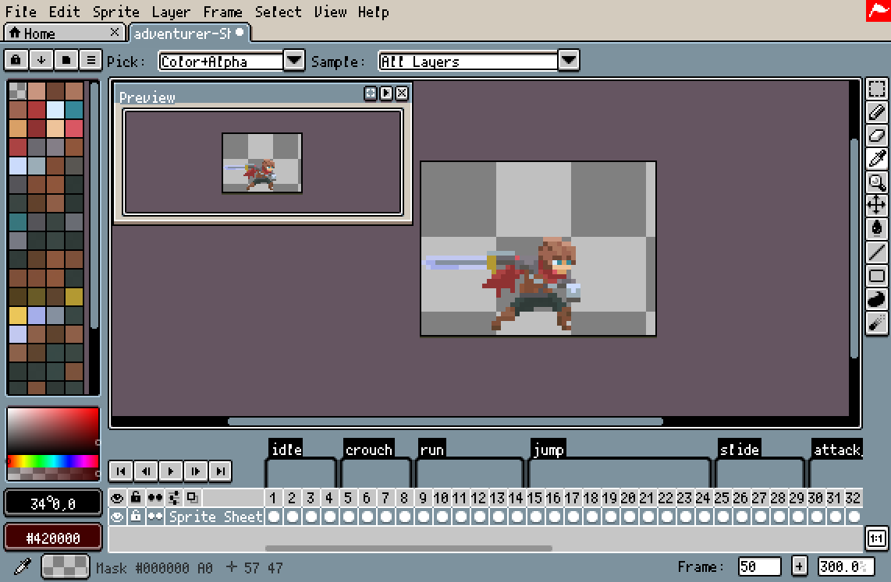
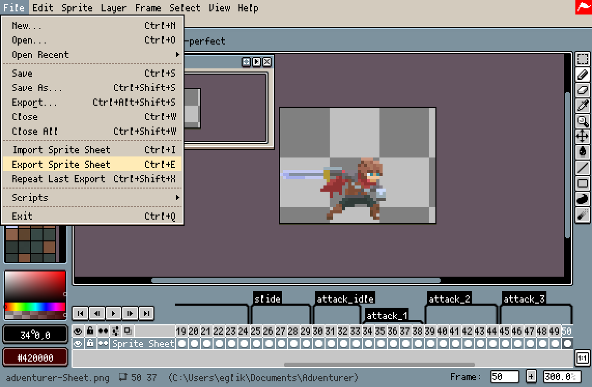
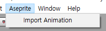
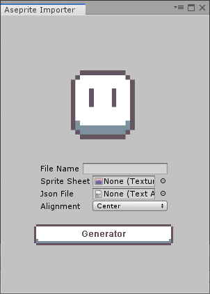
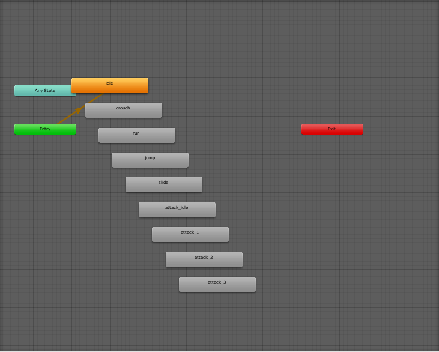

# Quick Start
AsepriteAnimator is auto split sprite sheet, Create `Animation` files and connect on `Animator Controller`.

## Export Sprite Sheet
 
First. you need to set some tags in Aseprite.

 
Second. Click the `File->Export Sprite Sheet`

 
You need two files(Output File, Json Data). Save these.

## Plugin Guide
 
You can see `Aseprite->Import Animation` on top menu.

 
Input datas file name on `File Name`, sprite sheet png file on `Sprite Sheet`, json file on `Json File` and then click the generate button.

 
 
 
Sprite sheet is split automatically, create `Animation` files by your tags and connect on `Animator Controller`.

## Done
 
You can see all animations work.
