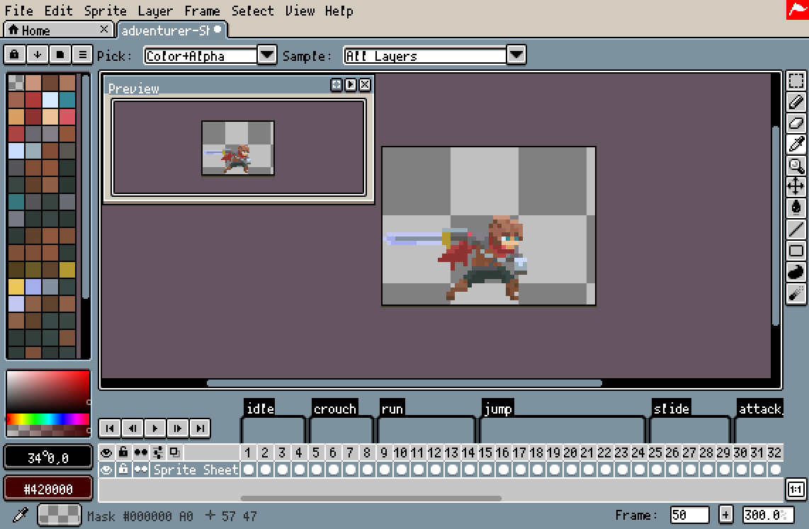
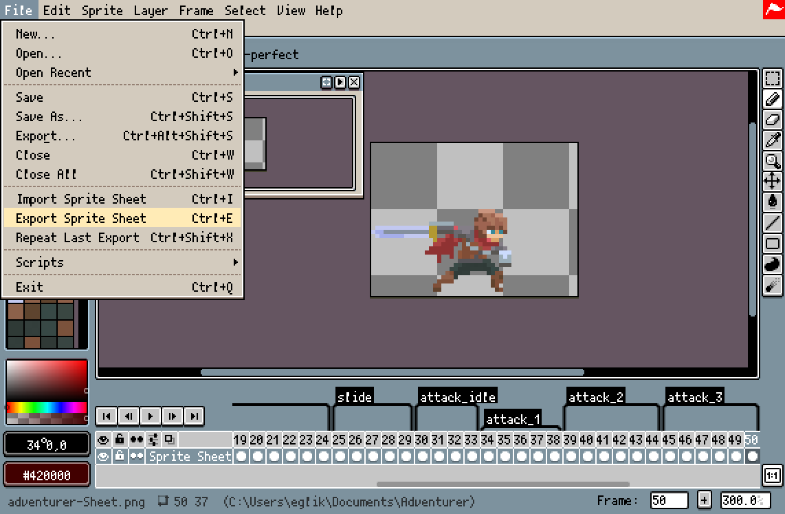
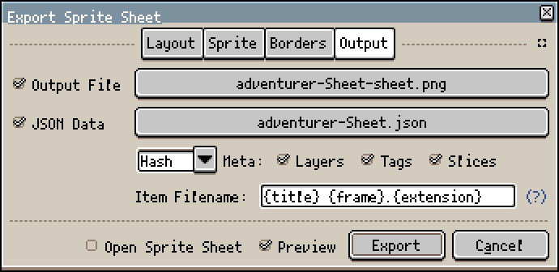
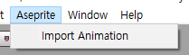
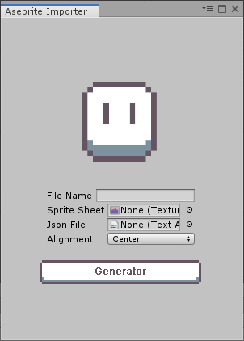
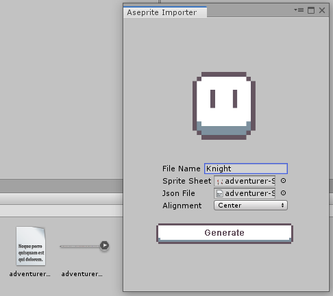
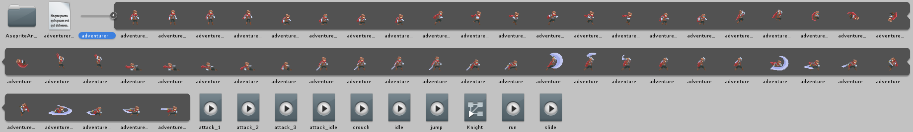
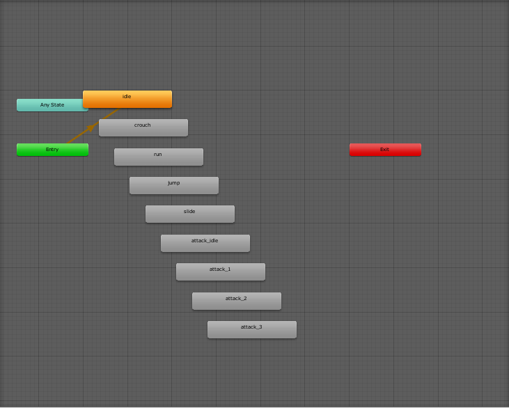
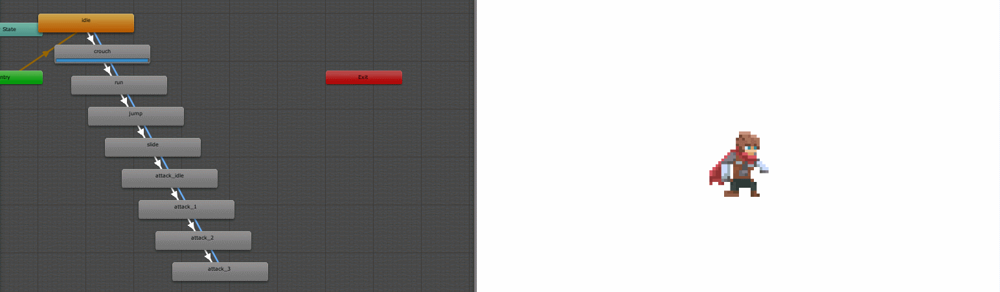

# Quick Start
AsepriteAnimator는 Aseprite로 작업한 스프라이트 시트를 자동으로 분리하고, `Animation`들을 자동으로 생성하며 `Animator Controller`에 등록합니다.

## Export Sprite Sheet
 
첫번째로 해야할 것은 Aseprite에서 애니메이션 별로 태그를 나눠주어야 합니다.

 
`File->Export Sprite Sheet`을 클릭합니다.

 
Output File과 Json Data를 저장해야 합니다.

## Plugin Guide
 
상단 메뉴바에 Aseprite->Import Animation을 클릭합니다.

 
`File Name`에는 `Animator Controller`파일의 이름, `Sprite Sheet`는 Aseprite에서 받은 png파일을, `Json File`에는 Aseprite에서 받은 json파일을 넣은 후 Generator 버튼을 클릭합니다.

 
 
 
Sprite Sheet가 자동으로 분리되고 Aseprite에서 설정한 태그들이 `Animation`으로 만들어지고 `Animator Controller`에 자동으로 등록되어 있습니다.

## Done
 
모든 애니메이션이 정상적으로 작동하는것을 확인할 수 있습니다.
